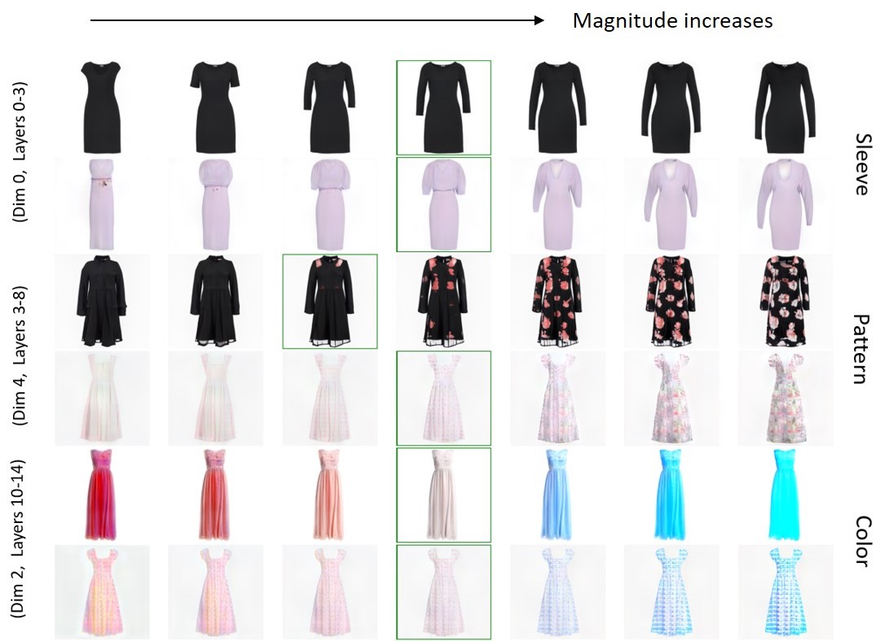
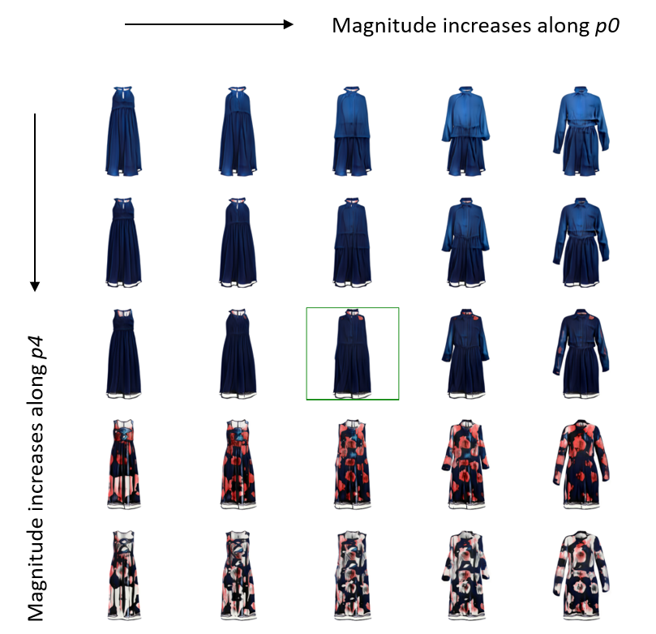
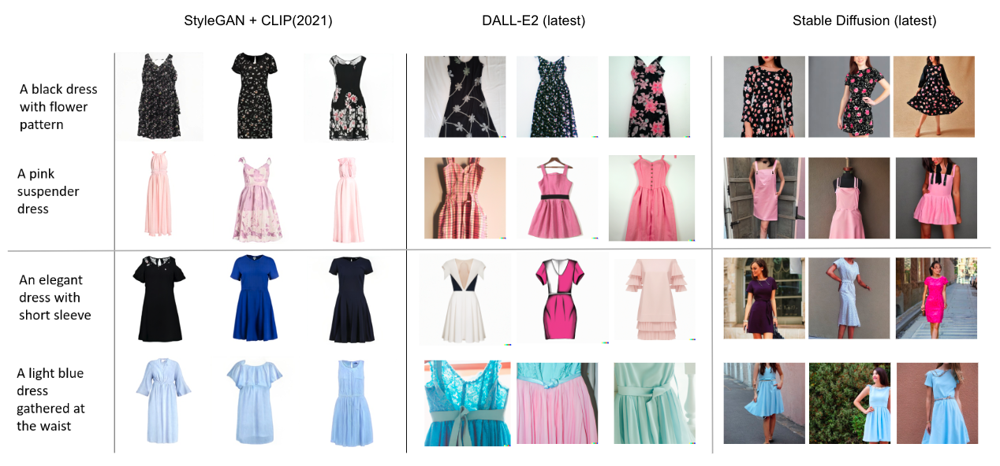
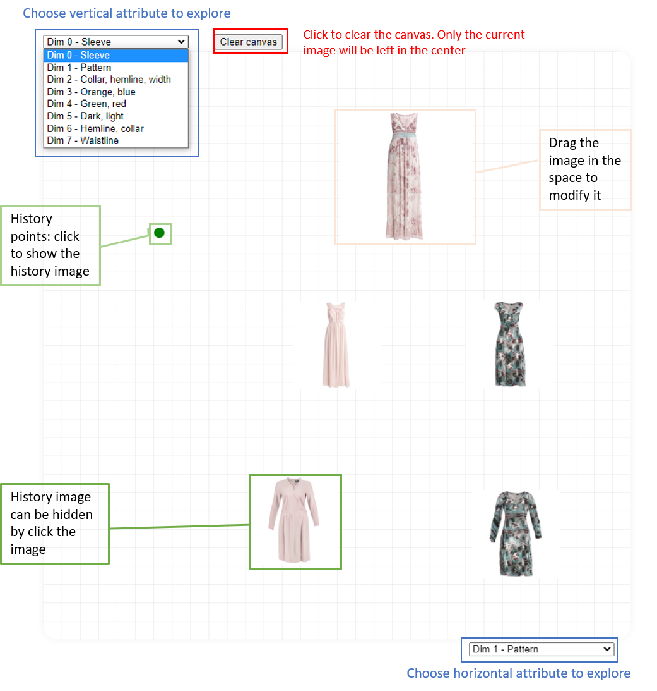
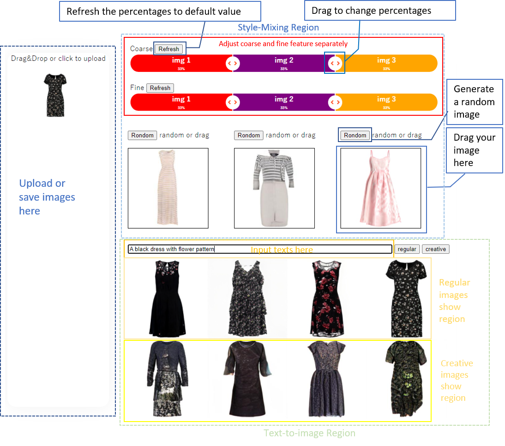

# Fashion Generation through Controllable StyleGAN

GANs for All: Supporting Fun and Intuitive Exploration of GAN Latent Spaces  

Author: Wei Jiang, Richard Lee Davis, Kevin Gonyop Kim, Pierre Dillenbourg  

https://proceedings.mlr.press/v176/jiang22a.html  

Abstract: We have developed a new tool that makes it possible for people with zero programming experience to intentionally and meaningfully explore the latent space of a GAN. We combine a number of methods from the literature into a single system that includes multiple functionalities: uploading and locating images in the latent space, image generation with text, visual style mixing, and intentional and intuitive latent space exploration. This tool was developed to provide a means for designers to explore the "design space" of their domains. Our goal was to create a system to support novices in gaining a more complete, expert understanding of their domain{’}s design space by lowering the barrier of entry to using deep generative models in creative practice.

## Dataset
We use [Zalando dataset](https://github.com/zalandoresearch/feidegger)
which can also be downloaded from [Google drive](https://drive.google.com/file/d/1vmBHGiqoICdaLaUqFUy6YiXMBLPuhTCy/view?usp=drive_link).
The dataset itself consists of 8732 high-resolution images, 
each depicting a dress from the available on the Zalando shop against a white-background.

## Train StyleGAN Model
Train fashion gan from scratch
```commandline
!python train.py --outdir "training_runs" --snap 20 --metrics "none" --data "data/square_256_imgs.zip"
```
If the resume the model from a checkpoint, we can --resume
```commandline
!python train.py --outdir "training_runs" --snap 20 --metrics "none" --data "data/square_256_imgs.zip" --resume "training_runs/00015-square_256_imgs-auto1-resumecustom/network-snapshot-000400.pkl"
```

## Finetune DALL-E Model


## Models
Download the models in the following links and save them in your Google Drive.

|         Model          |                                                      Download                                                       |
|:----------------------:|:-------------------------------------------------------------------------------------------------------------------:|
| Pretrained fashion GAN | [fashion-gan-pretrained.pkl](https://drive.google.com/file/d/1wjMtDejgj1GZmf0AqKY6LzKld3Rirbuo/view?usp=drive_link) |
| Finetuned DALL-E model |    [DALLE-finetuend.pkl](https://drive.google.com/file/d/1yhtBeFMc-kTW3nOsxYgwJb6CffFe-V_e/view?usp=drive_link)     |

## Explore Latent Space
We applied PCA analysis to identify the semantically meaningful directions in latent space. 
By exploring the first 10 principle components, we found sleeve, pattern, etc.

[](https://drive.google.com/file/d/1S-iiGj6f4PgWsQJVfFduLv1XUskxniZT/view?usp=sharing)

To project the image into latent space, we employ SGD with perceptual loss + pixel-by-pixel MSE loss between two images. 
This loss noticeably improved our tool’s ability to embed out-of-sample examples in the latent space of the GAN.

$$ w^{*} = \min_{w}$$ L(w) =  \min_{w} \lVert f(G(w)) - f(I) \rVert_2^2 + \lambda_{pix} \lVert G(w) - I \rVert_2^2 $$

Examples of interpolating images simultaneously along two meaningful directions
in the latent space (sleeve and pattern) found using PCA. The image in the green
box shows the original image with 0 magnitude.


## Text-to-image generation
We implemented two
methods to locate the design. The first method was to randomly sample images from the
latent space, then to pass these along with the text description through a CLIP. model to find a small number of images which most closely matched the
text. The second method was to fine-tune a DALL-E model on the
Feidegger dataset, and then to pass the text descriptions to DALL-E and let it generate
designs. We compare it with other models: 
- FahionGAN: realistic, diverse but low resolution. 
- DALLE: diverse, creative but less accurate.
- Stable Diffusion:  accurate, high resolution but not diverse (when given specific text with only changing background and models).



## WebApp
We have built a website for user testing: generarive.fashion

https://generative.fashion

[](https://www.youtube.com/watch?v=dcC7G2zBuL8&t=42s)

To run it in Google Colab: [](https://colab.research.google.com/drive/1VY3-9zvnXqjYNxNzGqZgF0pRfafdGpJm#scrollTo=JFgsJTee-EnO)

The interface of our neural design space exploration tool. Users can upload images
in the workplace on the left or generate random image through random button.
Also, they can generate examples via text descriptions using the text box. Users
can drag these examples to the style-mixing region or save them in the workplace. Users can selectively combine elements from three designs using the visual
style-mixing panel. The output image is shown in the center of the canvas on the
right. The 2D-dimensional canvas represents the design space for two attributes
in the horizontal and vertical axes, and these attributes can be changed by using
a drop-down menu for each axis. Dragging the image within the canvas is equivalent to moving through the latent space of the GAN in semantically meaningful
directions.


